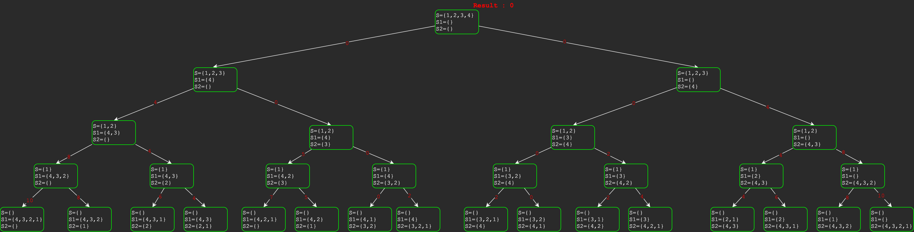

## Approach
This problem is an optimization version of the partition problem. 
The idea is to consider each item in the given set `S`  one by one, 
and for each item, there are two possibilities: 
  1. Include the current item in subset `S1`  and recur for the remaining items. 
  1. Include the current item in the subset `S2`  and recur for the remaining items.

Finally, return the minimum difference we get by including the current item in `S1`
and `S2`. When there are no items left in the set, return the absolute difference 
between elements of `S1` and `S2`.

## Java Source 
[MinimumSumPartition.java](../src/main/java/dp/MinimumSumPartition.java)

## Recursion Tree

  * For any node the left child adds to set `S1` and right child adds to set `S2`.
  * The read number on each arrow shows the return value as per the algo. 

